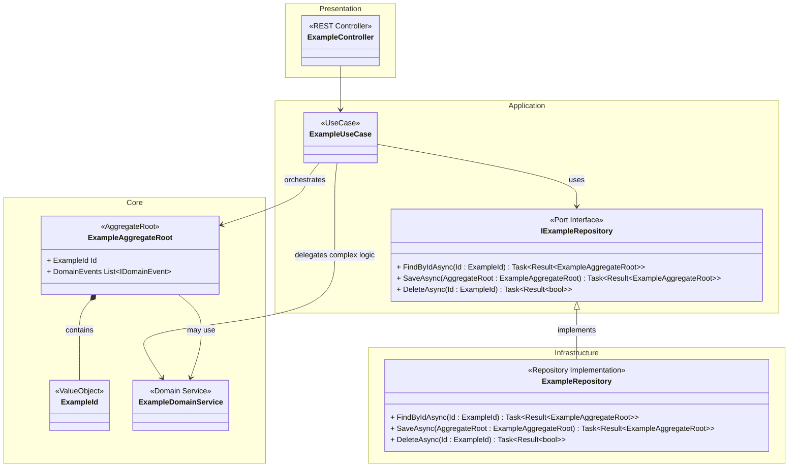
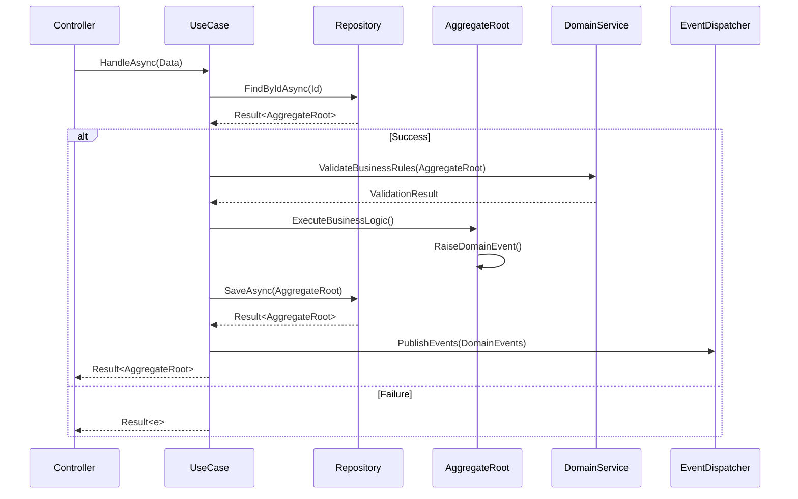

# Ubiquitous Language Dictionary

| Term                                 | Definition                                                                                                                                                              | Aliases                     | Example of Usage                                                                                                                               | Related Terms                                                                                                |
| :----------------------------------- | :---------------------------------------------------------------------------------------------------------------------------------------------------------------------- | :-------------------------- | :--------------------------------------------------------------------------------------------------------------------------------------------- | :----------------------------------------------------------------------------------------------------------- |
| **Product Feedback Sorter** | An automatic, LLM-powered system that analyzes textual user feedback, categorizes it, identifies related project features, analyzes sentiment, and generates a title.     | N/A                         | "This is an automatic, LLM-powered, product feedback sorter."                                                                                  | User Feedback, Feedback Category, Feature Category, Sentiment, Title, LLM                                    |
| **User Feedback** | Textual, natural language input provided by users regarding a product, which the system analyzes.                                                                       | Feedback                    | "Given textual, natural language user feedback, this system will analyze it..."                                                                | Product Feedback Sorter, Feedback Category, Feature Category, Sentiment, Title, Timestamp                      |
| **Feedback Category** | One or more predefined classifications assigned to user feedback, specifically 'General feedback', 'Bug report', or 'Feature Request'.                                   | N/A                         | "Put the feedback into one or more of the following categories: 'General feedback', 'Bug report', 'Feature Request'"                             | User Feedback, Feature Category, Analyzed Feedback List                                                      |
| **Feature Category** | A project feature that the user feedback is about, identified by the LLM. The system aims to avoid redundancy and allows for new categories to be created.                | N/A                         | "...analyze what project feature the text is about. Users might write about multiple features, so each feedback given should have zero or more features" | User Feedback, Feedback Category, LLM, Analyzed Feedback List                                                |
| **Sentiment** | The emotional tone of the user feedback, analyzed by the system and chosen from 'Positive', 'Negative', 'Neutral', or 'Mixed'.                                          | N/A                         | "The system should also aim to analyze sentiment and choose one of the following: 'Positive', 'Negative', 'Neutral', 'Mixed'."                 | User Feedback, LLM, Analyzed Feedback List                                                                   |
| **Title** (of feedback)            | A concise, maximum 50-character summary of the user feedback generated by the LLM, used in listing views.                                                               | N/A                         | "The system will also generate a max 50 character title for the feedback which is used in listing views of the feedback."                        | User Feedback, LLM, Analyzed Feedback List, Feedback not successfully analyzed list                          |
| **Timestamp** | A marker indicating when a piece of user feedback enters the system.                                                                                                    | N/A                         | "When feedback enters the system, it will be given a timestamp"                                                                                | User Feedback, Analyzed Feedback List                                                                        |
| **Feedback Form View** | The user interface section where new user feedback can be entered, including a text area and submission controls.                                                         | Feedback form               | "Feedback form where new feedbacks can be entered"                                                                                           | Navigation Bar, Toaster Notification, User Feedback                                                          |
| **Feedback Browser View** | The user interface section that lists analyzed and unanalyzed feedback, allowing users to open and view details.                                                          | Browser view                | "A browser view where analyzed feedbacks are listed and can be opened."                                                                      | Navigation Bar, Analyzed Feedback List, Feedback not successfully analyzed list                                |
| **Navigation Bar** | A UI component that enables users to easily switch between the Feedback Form View and the Feedback Browser View.                                                        | N/A                         | "User should be able to jump between the views easily as this is a portfolio app using navigation bar."                                      | Feedback Form View, Feedback Browser View                                                                    |
| **Toaster Notification** | A UI element for displaying brief messages, such as errors during feedback submission or success confirmations.                                                           | N/A                         | "If there is an error, there will be a toaster notification mentioning the error."                                                             | Feedback Form View                                                                                           |
| **Analyzed Feedback List** | A paged, sortable, and filterable list within the Feedback Browser View displaying successfully processed feedback items with their details.                              | N/A                         | "Has a paged list of feedback given." (referring to the list of analyzed feedback)                                                             | Feedback Browser View, Title, Timestamp, Feedback Category, Feature Category, Sentiment                        |
| **Feedback not successfully analyzed list** | A paged and sortable list within the Feedback Browser View for feedback items where LLM analysis failed, showing a title or truncated feedback and a retry option. | N/A                         | "There is also a list for feedback whose analysis was failed."                                                                                 | Feedback Browser View, LLM, Retry Count, Title                                                               |
| **Retry Count** | A counter, starting from zero, indicating the number of times a re-analysis attempt has been made for a feedback item in the 'Feedback not successfully analyzed list'.   | N/A                         | "...and a 'retry count' (starts from zero)."                                                                                                 | Feedback not successfully analyzed list                                                                      |
| **LLM** (Large Language Model)       | The core artificial intelligence component responsible for analyzing feedback text and extracting information like title, categories, and sentiment.                        | N/A                         | "When asked to analyze feedback, the following information is provided to the LLM..."                                                        | Product Feedback Sorter, Feature Category, Sentiment, Feedback Category, System Prompt, Feedback not successfully analyzed list |
| **System Prompt** | A set of instructions provided to the LLM to guide its behavior and the format of its output when analyzing feedback.                                                 | N/A                         | "The LLM is given a system prompt that instructs how to form the desired output."                                                              | LLM                                                                                                          |


# Requirements and General Description

## Introductions


This is an automatic, *LLM*-powered, *Product Feedback Sorter*. Given textual, natural language *User Feedback*, this system will analyze it and do the following things:
- Put the *User Feedback* into one or more of the following categories: 'General feedback', 'Bug report', 'Feature Request'
- Given the text, analyze what project feature the text is about. Users might write about multiple features, so each *User Feedback* given should have zero or more features
- The system should try to avoid redundancy for *Feature Category*. For example, there probably should not be a *Feature Category* 'Login form' and a *Feature Category* 'Login page'. 
- The system should also aim to analyze *Sentiment* and choose one of the following: 'Positive', 'Negative', 'Neutral', 'Mixed'. Mixed means that there is negative and positive *Sentiment* in the single text.
- The system will also generate a max 50 character *Title* for the *User Feedback* which is used in listing views of the *User Feedback*.
- When *User Feedback* enters the system, it will be given a *Timestamp*
- When *User Feedback* is given, it is expected to be relevant to a single product. However, the system should work without knowing what the product is.

This is a Portfolio app / tech demo. There will not be authentication or authorization.

## Application Views

There will be two views in the system:
- *Feedback Form View* where new *User Feedback* can be entered
- A *Feedback Browser View* where analyzed *User Feedback* are listed and can be opened.

User should be able to jump between the views easily as this is a portfolio app using *Navigation Bar*.

### Feedback Form View

- Has a large text area for pasting the *User Feedback*
- Has a 'submit' button
- Has a 'paste' button. When pressed, pastes the clipboard contents to the text area.

The *Feedback Form View* will be disabled while the *User Feedback* is being submitted.
If there is an error, there will be a *Toaster Notification* mentioning the error. Form is not cleared
If the submission is successful, there will be a *Toaster Notification* about this, and the form is cleared.

Submission is considered successful when the server acknowledges that it has received the submission. Server will respond as success when it has received the text. It will not wait for the *LLM* processing. *User Feedback* submission UI will not be notified of the *LLM* processing results.

Acceptable *User Feedback* length is between 3 and 2000 characters.

### Feedback Browser

#### Analyzed Feedback List

- Has a paged list of *User Feedback* given.
- Each list item has the following shown:
  - *Title* of the *User Feedback*
  - *Timestamp* of the *User Feedback* (UTC)
  - *Feedback Category* associated with the *User Feedback* (General feedback, Bug report, Feature Request)
  - *Feature Categories* related to the *User Feedback*
  - *Sentiment* of the *User Feedback*
- The list should be
  - on multiple pages if long (20 *User Feedback* per page)
  - sortable (*Title*, *Timestamp*)
  - filterable (at least by *Feedback Category* and feature, using 'AND' logic. If multiples of same type (e.g. multiple *Feedback Category*) are selected, then these should be processed with OR logic. Example: '((Feature Request OR Bug report) AND (Login Form OR Reset Password))'
- Each item can be opened. A modal window will show the *User Feedback* details, including the full *User Feedback*. All of the information about this *User Feedback* item shown in the list is also shown here.


#### Feedback not successfully analyzed list

- There is also a list for *User Feedback* whose analysis was failed.
- If *Title* generation was successful, then *Title* of the *User Feedback* will be shown. If not, then the first 30 characters of the *User Feedback* (with whitespace normalized) will be shown
- For each item, there will be a 'retry' button, and a *Retry Count* (starts from zero).
- The list should be
  - on multiple pages if long (20 *User Feedback* per page)
  - sortable (*Title*, *Timestamp*)

The paging, sorting and filtering should be done in the backend (so the REST api should support these features)

When user retries sending the *User Feedback*, the *User Feedback* is re-processed as if it was submitted at that time. *Timestamp* is not updated. The *User Feedback* is removed from the list upon clicking 'retry' (it'll re-enter the list if the retry is unsuccessful).

The reasons why a *User Feedback* might be added to this list:
- There is a problem calling the *LLM* (500 error, network error...)
- *LLM* does not succeed in providing the correct output (validation fails)
- *LLM* indicates that it is not able to Analyze the *User Feedback*, or it determines that the text entered is not a *User Feedback*, but some other text.


## LLM Usage

When asked to analyze *User Feedback*, the following information is provided to the *LLM*:
- The *User Feedback* text
- The *Feature Category* recognized so far (*LLM* can choose whether to tag the new *User Feedback* with the existing *Feature Category*, or create new ones for this *User Feedback* if existing categories do not fit). Initially, there will be no features.
- The choices from which *Sentiment* should be chosen
- The choices from which *Feedback Category* should be picked

The *LLM* is asked to provide at least the following information:
- Is the given text a *User Feedback* of a product (Yes/No)?
- What would be a max 50 character *Title* for the *User Feedback*?
- Which *Feature Category* (zero or more) would describe this *User Feedback*?
- Which *Sentiment* (exactly one) would describe this *User Feedback*?
- Which *Feedback Category* (one or more) would describe this *User Feedback*?

The *LLM* is given a *System Prompt* that instructs how to form the desired output. This prompt will be developed at a later stage.

## Future Functionality

In the future, there will be a way to curate the *Feature Category* (for example, combining them and adding meta data so that it is easier for *LLM* to recognize the category).


# Project Architecture

The project architecture is based on the following principles:
- **Domain-Driven Design (DDD):** Focus on the core business domain and domain logic
- **Clean Architecture:** Dependency inversion with domain at the center
- **Hexagonal Architecture (Ports and Adapters):** Clear boundaries between internal and external concerns
- **CQRS (Command Query Responsibility Segregation):** Separation of command and query operations
- **Event-Driven Architecture:** Domain events for decoupled communication

## Project Structure: Package by Layer with Feature Folders

This project employs a **Clean Architecture**, organizing code by layers with **feature folders** within each layer for components like `UserFeedback` and `FeatureCategory`. This promotes separation of concerns and feature cohesion.

The solution comprises these C# projects:

1.  `FeedbackSorter.SharedKernel`
2.  `FeedbackSorter.Core` (Domain Layer)
3.  `FeedbackSorter.Application` (Application Layer)
4.  `FeedbackSorter.Infrastructure` (Infrastructure Layer)
5.  `FeedbackSorter.Presentation` (Presentation Layer)

### Layer Responsibilities and Folder Structure

#### 1. `FeedbackSorter.SharedKernel`
* **Purpose:** Shared code and types (base classes, generic Value Objects like `Timestamp`, common interfaces) with minimal dependencies, referenced by other layers.
* **Example Contents:** `Entity.cs`, `ValueObject.cs`, `Timestamp.cs`.

#### 2. `FeedbackSorter.Core` (Domain Layer)
* **Purpose:** Core business logic, entities, aggregates, Value Objects, domain services, and events. No dependencies on Application, Infrastructure, or Presentation layers.
* **Root Directory**: `/src/FeedbackSorter.Core`
* **Dependencies:** `FeedbackSorter.SharedKernel`.

Illustrative directory structure:
```
/src/FeedbackSorter.Core/<feature_name>/*.cs
/src/FeedbackSorter.Core/<feature_2_name>/*.cs
```

#### 3. `FeedbackSorter.Application` (Application Layer)
* **Purpose:** Orchestrates use cases via commands and queries. Defines interfaces (ports) for infrastructure dependencies.
* **Root Directory**: `/src/FeedbackSorter.Application`
* **Dependencies:** `FeedbackSorter.Core`, `FeedbackSorter.SharedKernel`.


#### 4. `FeedbackSorter.Infrastructure` (Infrastructure Layer)
* **Purpose:** Implements external concerns: database access (repositories), external API clients (LLM service), message buses. Implements ports defined in the Application Layer.
* **Root Directory**: `/src/FeedbackSorter.Infrastructure`
* **Dependencies:** `FeedbackSorter.Application`, `FeedbackSorter.Core`, `FeedbackSorter.SharedKernel`.

#### 5. `FeedbackSorter.Presentation` (Presentation Layer)
* **Purpose:** Handles user interaction (e.g., API endpoints). Sends commands/queries to the Application Layer.
* * **Root Directory**: `/src/FeedbackSorter.Presentation`
* **Dependencies:** `FeedbackSorter.Application`, `FeedbackSorter.SharedKernel`.


## Layer Responsibilities

### `Core` Layer (Domain)

**Purpose:** Contains the domain logic and business rules. This is the most independent layer and represents the heart of the business.

**Contents:**
- **Entities and Aggregate Roots:** Core business objects with identity and lifecycle
- **Value Objects:** Immutable objects that describe characteristics
- **Domain Services:** Business logic that doesn't naturally fit within entities
- **Domain Events:** Represent significant business occurrences
- **Domain Exceptions:** Business rule violations and domain-specific errors
  
**References:** This layer may reference the `SharedKernel` project

### `Application` Layer (Use Cases)

**Purpose:** Contains application logic and use cases. Orchestrates domain objects and coordinates with external systems.

**Contents:**
- **Commands and Queries:** Define user intents and data requests
- **Command and Query Handlers:** Implement use case logic
- **Domain Event Handlers:** React to domain events with application logic
- **Application Services:** Coordinate complex workflows
- **Port Interfaces:** Define contracts for external dependencies (repositories, external services)


**References:** This layer may reference the `Core` and `SharedKernel` projects.

### `Infrastructure` Layer (External Concerns)

**Purpose:** Contains implementation details for external systems, databases, and third-party integrations.

**Contents:**
- **Repository Implementations:** Concrete data access implementations
- **Adapters:** Implementations of port interfaces for external systems
- **Database Context and Configuration:** Entity Framework or other ORM setup
- **External Service Clients:** HTTP clients, message brokers, etc.
- **Domain Event Dispatcher:** Publishing and handling of domain events
- **Persistence Models:** Database-specific entities and mappings

**References:** This layer may reference the `Core`, `Application` and `SharedKernel` projects.

### `Presentation` Layer (Interface)

**Purpose:** Contains user interfaces, API endpoints, and presentation logic.

**Contents:**
- **REST Controllers:** Handle HTTP requests and responses
- **Request/Response DTOs:** API-specific data contracts
- **Middleware:** Authentication, logging, error handling
- **API Configuration:** Swagger, versioning, CORS setup
- **Authentication/Authorization:** Identity management and security

**References:** This layer may reference the `Application`, `Core`, `Infrastructure`  and `SharedKernel`projects.

## CQRS Implementation

The project implements **CQRS with separate models**:

- **Commands:** Modify state and return simple success/failure results
- **Queries:** Retrieve data using optimized read models
- **Read Models:** Denormalized views optimized for specific queries
- **Write Models:** Rich domain models for business logic

## Request Processing Flow



## Runtime Sequence

### Command Process Sequence


# Code-level considerations

## General
- This project uses the 'nullable' annotation (example: `string?`) to mark that something may be null.
-  Always validate inputs at public API boundaries (e.g., Application Service use cases, Entity/VO constructors exposed to Application layer). Within the internal scope of a method where the compiler guarantees non-nullability, further checks may be redundant. Use ArgumentNullException.ThrowIfNull() or similar.
- Do not use primary constructors when data validation at construction time is needed. Use 'old-style' constructors in such cases.

## Value Objects
- Validate data input: prevent creation of invalid value objects
- Extract related data into value objects. For example, instead of having a 'BeginDate' and 'EndDate' in an entity, create a DateRange value object and add proper validation there.
- Consider `readonly record struct` for very simple, small value objects. For more complex value objects, or those frequently used as properties in classes, `record class` often provides a better balance of immutability, value-based equality, and ease of use without potential performance pitfalls associated with large structs or frequent boxing.

## Unit Tests
- Use `NSubstitute` when mocks or stubs are needed.
- Use xUnit. Use xUnit's assertions (and not a library like fluent assertions)

# Other instructions for GenAI/LLM
- When there is a `dotnet` cli command for doing something, use that instead of modifying code.
- Use `dotnet add package` command to add dependencies.
- Before adding a library not mentioned by the user, confirm that user wants to start using that library.