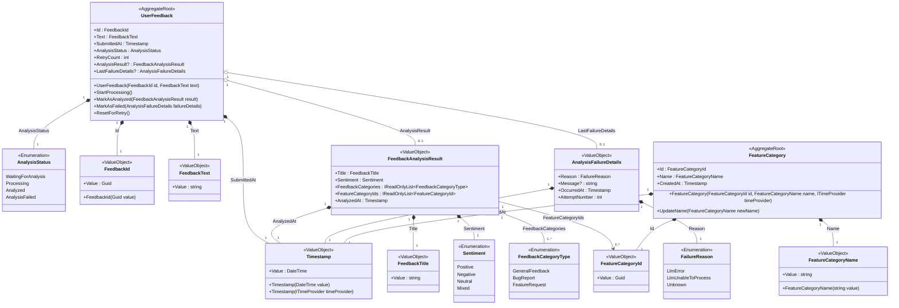

# Domain

```mermaid

classDiagram
    class FeedbackCategoryType {
        <<Enumeration>>
        GeneralFeedback
        BugReport
        FeatureRequest
    }

    class AnalysisStatus {
        <<Enumeration>>
        WaitingForAnalysis
        Processing
        Analyzed
        AnalysisFailed
    }

    class Timestamp {
        <<ValueObject>>
        +Value : DateTime
        +Timestamp(DateTime value)
        +Timestamp(ITimeProvider timeProvider)
    }


    class FeatureCategoryName {
        <<ValueObject>>
        +Value : string
        +FeatureCategoryName(string value)
    }

    class UserFeedback {
        <<AggregateRoot>>
        +Id : FeedbackId
        +Text : FeedbackText
        +SubmittedAt : Timestamp
        +AnalysisStatus : AnalysisStatus
        +RetryCount : int
        +AnalysisResult? : FeedbackAnalysisResult
        +LastFailureDetails? : AnalysisFailureDetails
        +UserFeedback(FeedbackId id, FeedbackText text)
        +StartProcessing()
        +MarkAsAnalyzed(FeedbackAnalysisResult result)
        +MarkAsFailed(AnalysisFailureDetails failureDetails)
        +ResetForRetry()
    }
    
    class FeedbackId {
        <<ValueObject>>
        +Value : Guid
        +FeedbackId(Guid value)
    }

    class FeedbackText {
        <<ValueObject>>
        +Value : string
    }

    class FeedbackTitle {
        <<ValueObject>>
        +Value : string
    }

    class FeedbackAnalysisResult {
        <<ValueObject>>
        +Title : FeedbackTitle
        +Sentiment : Sentiment
        +FeedbackCategories : IReadOnlyList~FeedbackCategoryType~
        +FeatureCategoryIds : IReadOnlyList~FeatureCategoryId~
        +AnalyzedAt : Timestamp
    }

    class AnalysisFailureDetails {
        <<ValueObject>>
        +Reason : FailureReason
        +Message? : string
        +OccurredAt : Timestamp
        +AttemptNumber : int
    }

    class FailureReason {
        <<Enumeration>>
        LlmError
        LlmUnableToProcess
        Unknown
    }
    
    class Sentiment {
        <<Enumeration>>
        Positive
        Negative
        Neutral
        Mixed
    }

    class FeatureCategory {
        <<AggregateRoot>>
        +Id : FeatureCategoryId
        +Name : FeatureCategoryName
        +CreatedAt : Timestamp
        +FeatureCategory(FeatureCategoryId id, FeatureCategoryName name, ITimeProvider timeProvider)
        +UpdateName(FeatureCategoryName newName)
    }

    class FeatureCategoryId {
        <<ValueObject>>
        +Value : Guid
    }

    UserFeedback "1" *-- "1" FeedbackId : Id
    UserFeedback "1" *-- "1" FeedbackText : Text
    UserFeedback "1" *-- "1" Timestamp : SubmittedAt
    UserFeedback "1" *-- "1" AnalysisStatus : AnalysisStatus
    UserFeedback "1" o-- "0..1" FeedbackAnalysisResult : AnalysisResult
    UserFeedback "1" o-- "0..1" AnalysisFailureDetails : LastFailureDetails

    FeedbackAnalysisResult "1" *-- "1" FeedbackTitle : Title
    FeedbackAnalysisResult "1" *-- "1" Sentiment : Sentiment
    FeedbackAnalysisResult "1" *-- "1" Timestamp : AnalyzedAt
    FeedbackAnalysisResult "1" o-- "1..*" FeedbackCategoryType : FeedbackCategories
    FeedbackAnalysisResult "1" --> "0..*" FeatureCategoryId : FeatureCategoryIds

    AnalysisFailureDetails "1" *-- "1" FailureReason : Reason
    AnalysisFailureDetails "1" *-- "1" Timestamp : OccurredAt

    FeatureCategory "1" *-- "1" FeatureCategoryId : Id
    FeatureCategory "1" *-- "1" FeatureCategoryName : Name
    FeatureCategory "1" *-- "1" Timestamp : CreatedAt
    
```
