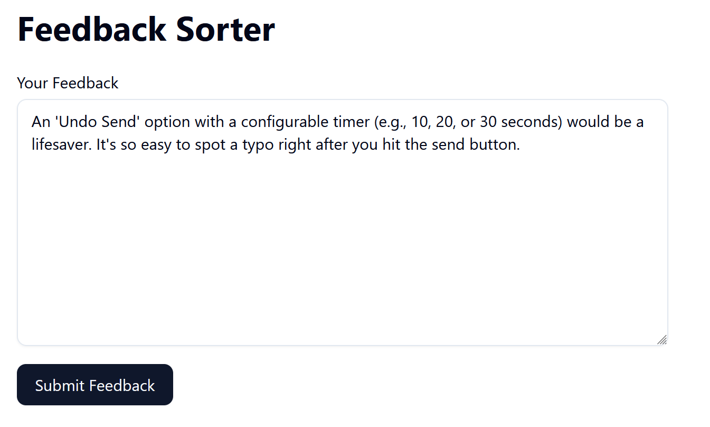
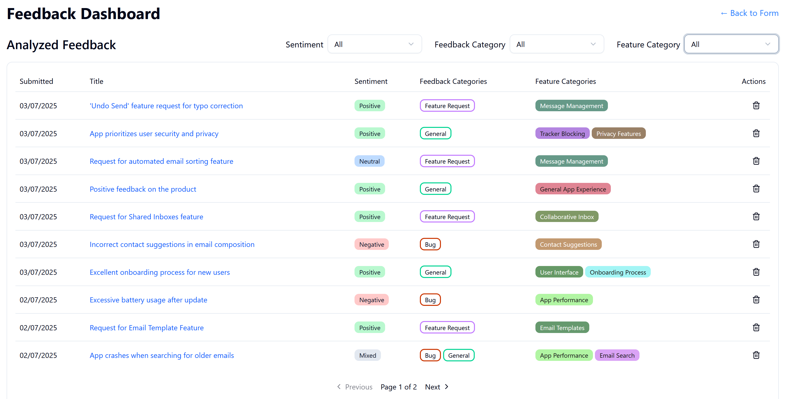
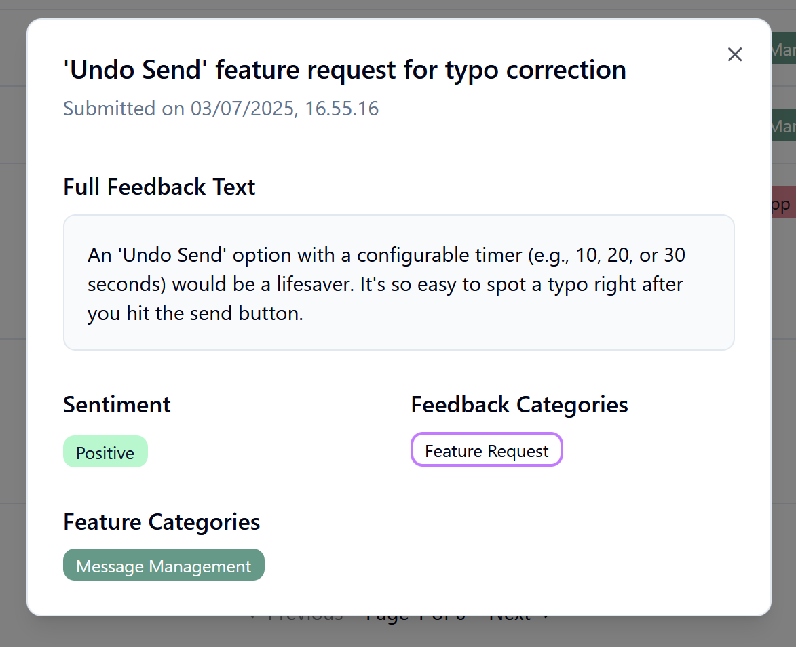
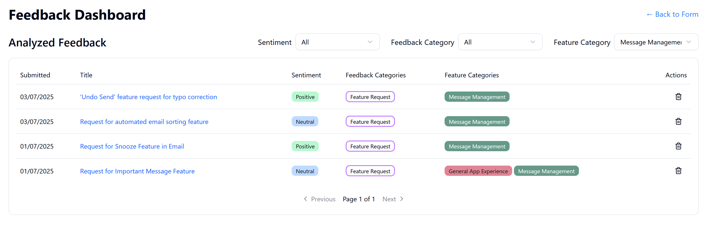

# FeedbackSorter

A proof-of-concept application that demonstrates an AI-powered feedback analysis system using Clean Architecture and Domain-Driven Design principles.

## What is FeedbackSorter?

FeedbackSorter is an intelligent feedback management system that automatically analyzes free-form textual user feedback using Large Language Models (LLMs). The system:

- **Accepts user feedback** in natural language (3-2000 characters)
- **Analyzes feedback automatically** using LLM integration to extract:
  - Sentiment (Positive, Negative, Neutral, Mixed)
  - Feedback categories (Bug Report, Feature Request, General Feedback)
  - Feature categories (dynamically identified features like "Authentication", "User Interface", etc.)
  - Generated titles for better organization
- **Provides REST API endpoints** for submitting feedback and querying analyzed results. These are used by the Next.JS frontend.
- **Supports advanced filtering** by sentiment, feedback type, and feature categories
- **Implements case-insensitive feature categorization** to avoid duplicates

## Technologies

- Backend: .Net, C#, relational databases, REST
- Frontend: Next.js

## Screenshots

### Submission form



The idea is that users of a product can give feedback on the product with free-form text. This text is later analyzed with an LLM to make browsing potentially hundreds or thousands such feedbacks easier



This is the list of Analyzed feedbacks.



Each of the analyzed feedbacks can be opened to view the original text, as well as the properties
from the Analysis



The analyzed feedbacks can be filtered in various ways, including feature category.
Since the LLM is given the list of existing feature categories, it will be able to pick an existing
one, if a suitable category exists.

(a further version of this system might include a category management system where admin could be
able to manage categories - combine them for example)

## Back-end Architecture

The application follows **Clean Architecture** with **Domain-Driven Design (DDD)** principles:

```
Backend/src/
├── FeedbackSorter.SharedKernel/     # Shared base classes, Result patterns
├── FeedbackSorter.Core/             # Domain Layer - Business logic & entities
├── FeedbackSorter.Application/      # Application Layer - Use cases & orchestration  
├── FeedbackSorter.Infrastructure/   # Infrastructure Layer - Data access & external services
└── FeedbackSorter.Presentation/     # Presentation Layer - REST API controllers
```


## Prerequisites

- [.NET 9.0 SDK](https://dotnet.microsoft.com/download/dotnet/9.0)
- [Node.js 18+](https://nodejs.org/) (for frontend)

## Getting Started

### 1. Clone the Repository

```bash
git clone <repository-url>
cd FeedbackSorter
```

### 2. Backend Setup

#### 2.1 Configure LLM Access

The application requires an API key from OpenRouter.ai to access LLM services:

1. **Get an API key**: Visit [https://openrouter.ai/](https://openrouter.ai/) and sign up for an account to obtain an API key.

2. **Store the API key securely** using .NET user secrets (never commit API keys to source control):

```bash
cd Backend

# Initialize user secrets for the presentation project
dotnet user-secrets init --project src/FeedbackSorter.Presentation

# Store your OpenRouter API key
dotnet user-secrets set "LLM:ApiKey" "your-actual-api-key-here" --project src/FeedbackSorter.Presentation
```

#### 2.2 Build and Run

```bash
# Restore NuGet packages
dotnet restore

# Build the solution
dotnet build

# Run database migrations (creates SQLite database)
dotnet ef database update --project src/FeedbackSorter.Infrastructure --startup-project src/FeedbackSorter.Presentation

# Start the API server
dotnet run --project src/FeedbackSorter.Presentation
```

The backend API will be available at `http://localhost:5225`.

### 3. Frontend Setup

```bash
cd frontend

# Install dependencies
npm install

# Start the development server
npm run dev
```

The frontend will be available at `http://localhost:3000`.

### 4. Access the Application

- **Frontend**: http://localhost:3000
- **Backend API**: https://localhost:5225
- **Swagger UI**: https://localhost:5225/swagger

## Hints for testing

The AI is not given any context regarding what kind of application or product the feedbacks
are about (in real world this would be essential so that the AI has more context for
its analysis). However, it is suggested to imagine a single product for which all the
feedbacks are given; this way the feature categorization will end up reusing same
categories.

I'd suggest using the following prompt with an LLM Chat (Chat GPT / Gemini / Claude)
to generate some feedback to test the system with:
```
I am testing an ai-enabled program for analyzing product feedback. For this purpose, can you give me ten fake feedbacks from people for an email client? Give me feedback that is bug reports, feature requests and general feedback. 
```
(you can naturally replace 'email client' with whatever kind of app or product you want).


## Key Features

### 🤖 **AI-Powered Analysis**
- Automatic sentiment detection
- Smart categorization of feedback types
- Dynamic feature category identification
- Title generation for better organization

### 🔍 **Advanced Filtering & Search**
- Filter (server-side) by sentiment, feedback type, and feature categories
- Case-insensitive feature category matching
- Pagination support for large datasets (server-side pagination)


### 🏗️ **Clean Architecture**
- Domain-driven design with clear separation of concerns
- CQRS pattern for optimized read/write operations
- Repository pattern for data access abstraction
- Background processing for non-blocking LLM analysis

### 🧪 **Comprehensive Testing**
- System tests verify end-to-end functionality
- Database integration tests with real Entity Framework operations


## Development Notes

This is a **proof-of-concept** application designed to demonstrate:
- Clean Architecture implementation in .NET
- Domain-Driven Design principles
- LLM integration patterns

**Not intended for production use** without additional considerations for:
- Authentication & authorization
- Production database configuration
- Security hardening
